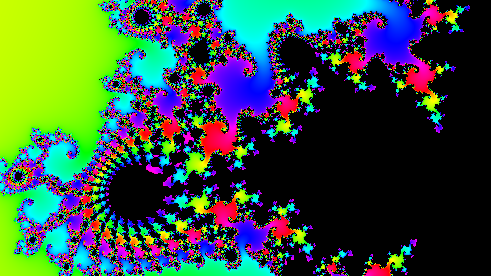

# Wallpaper Generator


*Full HD Mandelbrot rendered in 1.5 seconds*

This is a highly optimized wallpaper generator that can render up to 8K (7680 x 4320) images of **fractals, procedural images, algorithmic art, AI-generated art**, and more.

It uses Python's Numba JIT compiler to generate images at speeds of up to 1000x faster than pure Python.

## Installation

```bash
git clone https://github.com/Maicon-Moreira/wallpaper-generator
cd wallpaper-generator
pip install -r requirements.txt
```

## Usage

```bash
python mandelbrot.py
```
